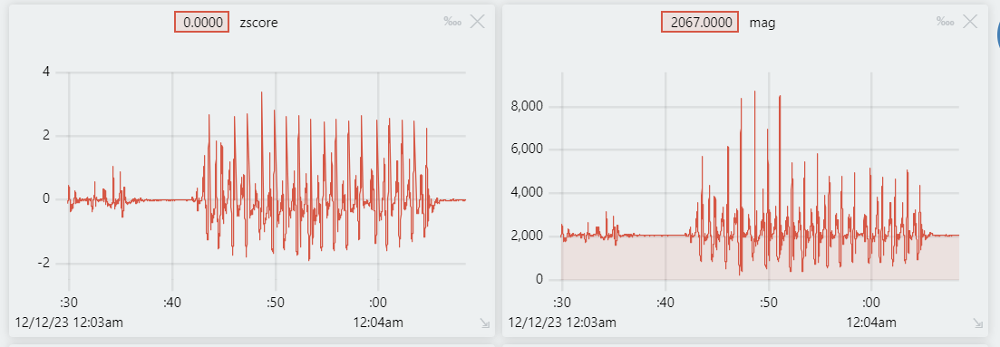

# Arduino Step Tracker, Final Project CS328

## LINK TO SLIDES [here](https://docs.google.com/presentation/d/1ColqYFM0euTa88CQ5PFyD8eiSrRo1e8qehB2PgmDlpc)

## Problem Statement

- Although we have learned to do step detection with pre-recorded data and potentially using phone data, we decided to do a little challenge.
- We wanted to see if it's possible to do real-time data processing on a small arduino microcontroller to make a step tracker.

## Potential application of the project

- There may not be a lot of practical application of this project because there are way better step detection algorithms out there, including phones. 
- This project was done as a learning experience and for fun, and it's also always cool to make hardware stuff. 

## Technical knowledge

- We applied the in-class knowledge of step detection by calculating magnitude
- Since it's almost impossible to run scipy and other libraries, we needed a different algorithm for smoothing and detection.
- We implemented an simplified version of the Z-score smoothing algorithm referenced below.
- By using a z-score peak detection, we can detect steps in real time.

## Implementation

- We used an accelerometer similar to a phone to detect leg movements as well as forward acceleration.
- Using a moving average array to do smoothing. A z-score peak detection will allow for peak detection based on previous values instead of hard coding.
- Here is a plot of the magnitude data we collected and the resulting z-score

- Based on the z-score plot, we can see that when the is a z-score above 2-2.5 or so, there is a step taken.
- Using the z-score method can accommodate for different intensity of acceleration, instead of hard-coding a magnitude threshold.

## Result

- We are able to implement a variation of the z-score smoothing algrithm to combile data smoothing and peak detection, filtering is harder to implement
- The device is functional and counting steps.
  
## Learning outcome

- We designed our own 3d printed case
- We also had a lot of challenges dealing with data types during the implementation.

## Future improvements

- Dynamically adjust z-score threshold for variation in steps.
- Improve the smoothing and filtering algorithm to better process accelerometer data.
- Improve runtime complexity and space complexity.

## References

- https://stackoverflow.com/questions/22583391/peak-signal-detection-in-realtime-timeseries-data/
- https://chrisruppel.com/blog/arduino-analog-signal-input-smoothing/
- https://dganesan.github.io/mhealth-course/chapter2-steps/ch2-stepcounter.html
- https://gcc.gnu.org/wiki/avr-gcc
- https://hackaday.io/project/167533-faster-speed-how-optimize-math-and-process-tasks/log/168869-faster-sqrt-but-less-accurate